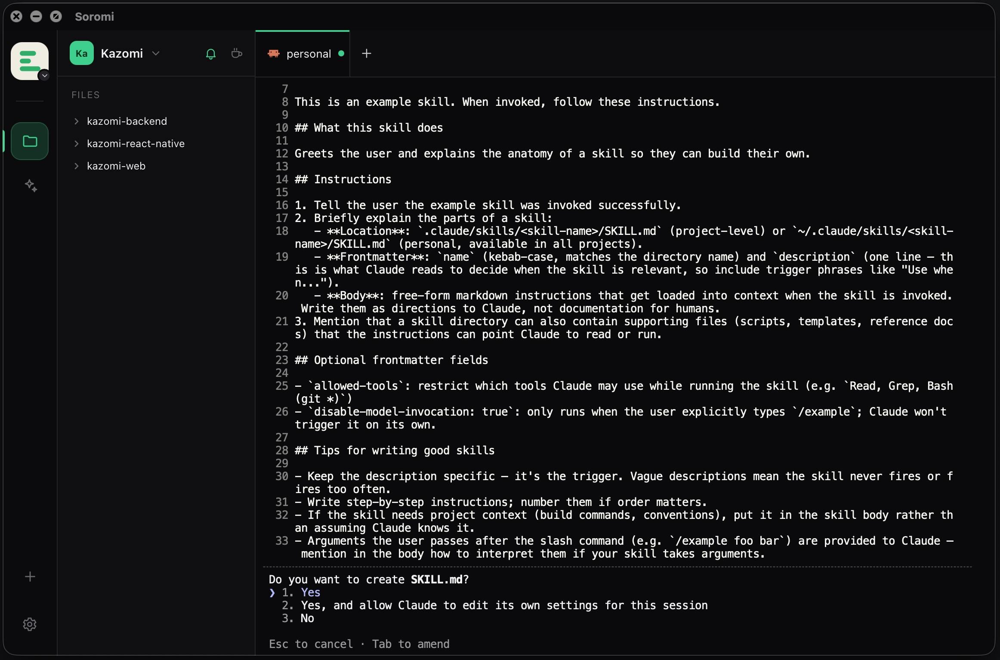
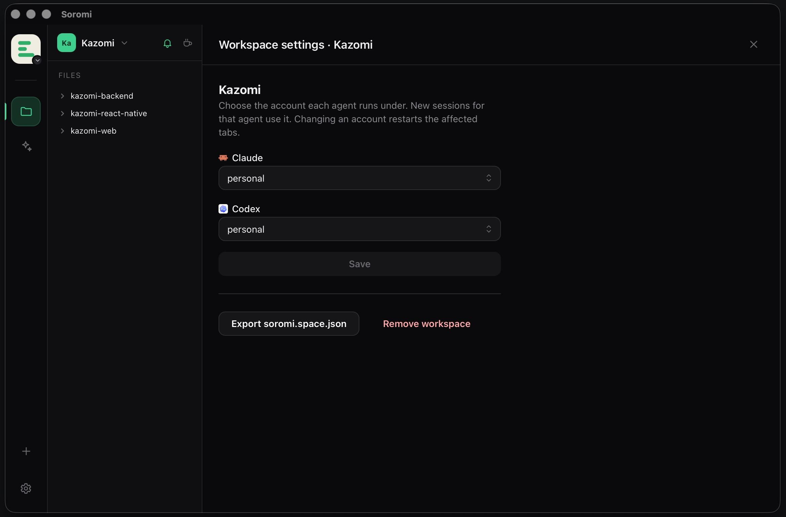
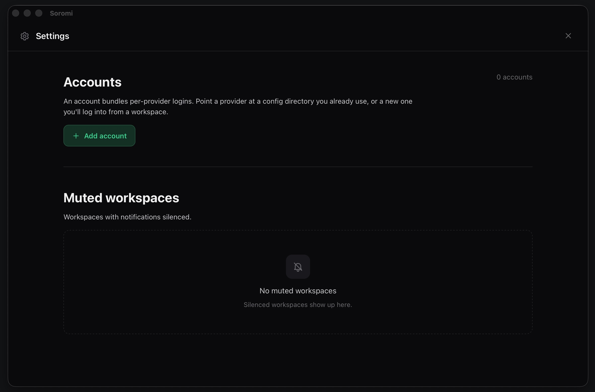
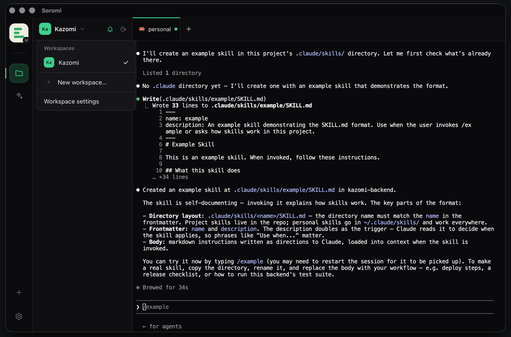
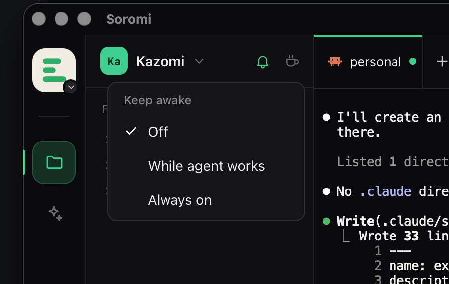
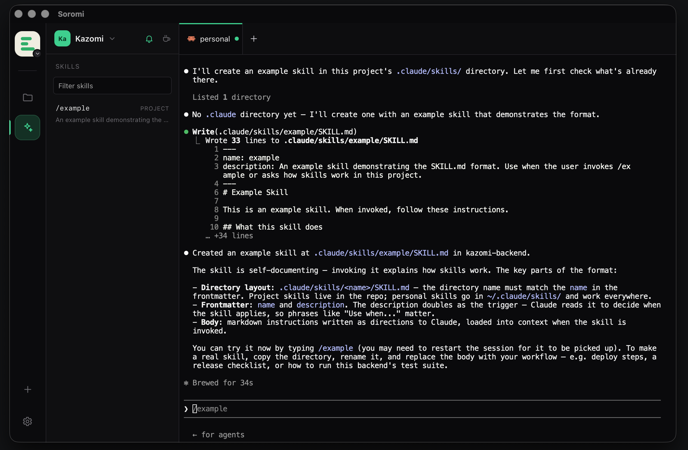
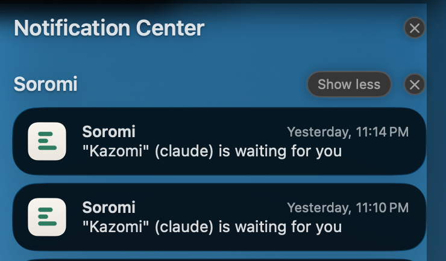

<p align="center">
  <picture>
    <source media="(prefers-color-scheme: dark)" srcset="assets/logo.png" />
    
  </picture>
</p>

# Soromi

_From Japanese 揃う (sorou), to be gathered, aligned, complete as a set._

## What is Soromi?

A small, fast, open-source home for AI coding agents. Each work folder, with all its repos,
gets a terminal, an agent, and the right account. Switch between them like Slack workspaces.

The daemon owns the terminals, so your agents keep running when you close the window. The GUI
is just a viewport onto them.

## Why?

I built Soromi because I was tired of juggling a separate editor window for every project and
wrestling my agents into the right context. Setup was manual and fiddly, and I kept worrying
about mixing up accounts that were meant for different things.

I just wanted one place: the folders, the skills, and the terminal together, so I could jump
between projects, get a nudge when an agent needs me, keep the machine awake while it works, and
eventually glance at what it is doing from my phone.

The tools I tried were often heavier than I wanted or did far more than I needed, and left me
more confused than productive. So Soromi stays small and gets out of the way.

## Features

- **A workspace for every project.** Point Soromi at a folder and it becomes a workspace with
  its own terminal. Jump between projects like switching Slack workspaces.
- **Terminals that stay alive.** Close the window and your agents keep working. Reopen and pick
  up exactly where you left off.
- **Multiple tabs per workspace.** Run several agents side by side in one project, name them, and
  they come back after a restart.
- **Keep your accounts separate.** Give each agent its own login (work, personal, client) so they
  never mix.
- **Work on just the folders you choose.** Select the repos or folders that matter and the agent
  stays focused on them.
- **Browse files without leaving.** A read-only file tree and preview for quick reference; your
  real editor stays your editor.
- **Skills at a click.** See your agent's commands and skills in a sidebar and drop one into the
  terminal.
- **Know when it needs you.** A sound and a notification when an agent asks for permission or
  finishes, so you can step away. Mute any workspace you want.
- **Stay awake while it works.** Optionally keep your machine from sleeping until the agent is
  done.
- **Shareable setup.** Export a workspace to a small file anyone can import, or start fresh with
  no file at all.
- **Know when there's a new version.** Soromi checks for newer releases and shows a quiet banner
  with a link to download. Nothing installs behind your back.
- **One app, nothing to wire up.** Everything runs from a single desktop app.

## Screenshots

<table>
  <tr>
    <td></td>
    <td></td>
    <td></td>
    <td></td>
  </tr>
  <tr>
    <td></td>
    <td></td>
    <td></td>
    <td></td>
  </tr>
</table>

## Providers

A provider is a coding-agent CLI Soromi can run, isolate per account, and listen to. Adding one
is a small entry in the provider registry (`crates/daemon/src/config.rs`).

| Provider        | Account isolation      | Event cues (sound + notification)                          | Folder scoping         | Skills             |
| --------------- | ---------------------- | ---------------------------------------------------------- | ---------------------- | ------------------ |
| **Claude Code** | `CLAUDE_CONFIG_DIR`    | Yes, via `settings.json` hooks (permission / done)         | Yes, via `--add-dir`   | Yes (commands + skills) |
| **Codex**       | `CODEX_HOME`           | Done via `notify`; permission via a hook you trust with `/hooks` | Runs at the first folder | Yes (prompts + skills) |

Notes:

- **Account isolation** points each account at its own config directory, so multiple logins
  (work, personal, client) stay separate. Accounts are referenced by name; no secrets are stored
  in `soromi.space.json`.
- **Event cues** are driven by the agent's own hook events, not terminal parsing, so they are
  robust across CLI versions. Sounds play with no OS permission; native notifications may prompt
  for permission once.

## How it works

- The **daemon** (Rust) owns every PTY, resolves accounts into launch environments, watches
  agent status, installs the agent event hooks, checks for newer releases, and speaks a small
  WebSocket protocol.
- The **GUI** (React + Zustand + xterm.js) is a pure viewport: it renders from protocol messages
  and sends input and resize. It holds no state authority of its own.
- The **protocol** is defined once in Rust (`crates/protocol`) and the TypeScript types are
  generated from it with [ts-rs](https://github.com/Aleph-Alpha/ts-rs), so the two never drift.
- The **desktop app** (Tauri) hosts the GUI in a webview and runs the daemon in-process on a
  local socket. The transport is kept deliberately simple so the same viewport can run remotely.

## Monorepo layout

```
crates/
  protocol/   Rust: the wire protocol (serde types), the single source of truth
  daemon/     Rust: PTY sessions, account resolution, status, agent hooks, WS server
packages/
  protocol/   TypeScript types generated from crates/protocol (do not edit by hand)
  gui/        React + Zustand + xterm.js viewport (runs in the desktop app's webview)
apps/
  desktop/    Tauri 2 app that runs the daemon in-process
```

Each package and crate has a README describing its boundaries.

## Development

Requires **Node 22+**, **pnpm 10**, and a stable **Rust** toolchain.

```bash
pnpm install         # install workspace deps
pnpm build           # build every package + the desktop bundle (turbo)
pnpm typecheck       # type-check the TypeScript packages
pnpm lint            # lint with biome
pnpm test            # run the vitest suite
pnpm gen:protocol    # regenerate the TypeScript protocol types from the Rust crate
```

The Rust crates have their own gate:

```bash
cargo fmt --check
cargo clippy --all-targets
cargo test
```

Run it:

```bash
pnpm desktop         # the full app (Tauri dev)
```

Or iterate on the two processes separately:

```bash
pnpm daemon          # the Rust daemon (serves the local WebSocket)
pnpm dev             # the GUI dev server against that daemon
```

Project rules and conventions live in [`CONTRIBUTING.md`](./CONTRIBUTING.md).

## License

MIT, see [LICENSE](./LICENSE).
